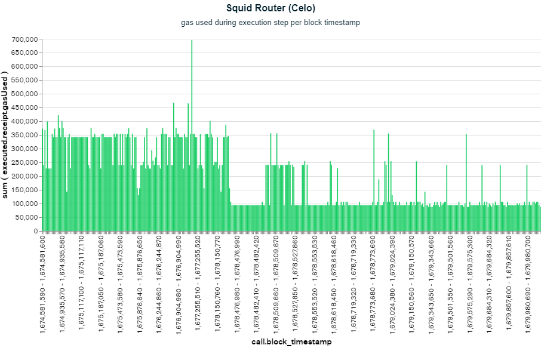
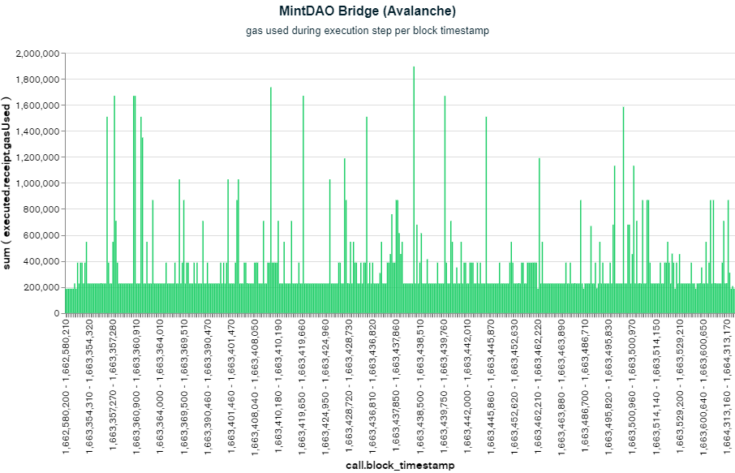

# Gas Data Aggregation and Estimation Project

## Introduction

This repository provides all necessary code to analyze AxelarGMP execution gas amounts using historical averages and payload byte comparison. 

### Installation

Make sure [NodeJS](https://nodejs.org/en/download/) is installed. 

1. Setup personal MongoDB account using Axelar email.  

Engineering credentials (in 1Password) can be used to invite your own account, or ask Kiryl for access.

2. Clone this repository.
```bash
git clone https://github.com/axelarnetwork/gas-estimation
```

3. Install dependencies.
```bash
npm install
```

4. Add MongoDB user password into `.env` file in root directory ```gas-estimation```.
```bash
URI_KEY="ENTER PASSWORD HERE"
```
Note: this is not your account login password, but the password associated with the database/cluster. You can change your password by accessing ```Security -> Database Access -> Edit Password``` in the left menu.

## Endpoint Usage

You can now access the express endpoint through the root directory ```gas-estimation```.

```bash
node .\app.js
```

Access the endpoint through ```http://localhost:3000``` on your browser.

### Historical Gas Data

```bash
http://localhost:3000/gas-data?chain={destination_chain}&contract={destination_contract}
```

The ```/gas-data``` endpoint takes two parameters, destination ```chain``` and ```contract```. If the destination pair exists, the endpoint returns the following object:

```json
{
  "info": {
    "chain": "celo",
    "contract": "0xce16F69375520ab01377ce7B88f5BA8C48F8D666",
    "transaction_count": 413
  },
  "average": 192742,
  "recent_average": 108352,
  "average_profit": {
    "0%": 84390,
    "3%": 90172,
    "5%": 94027,
    "8%": 99809,
    "10%": 103664
  }
}
```

In this example, the ```SquidRouter``` destination contract on the ```celo``` chain has 413 recorded ```transaction_count``` in the database with the gas amount ```average``` far exceeding the ```recent_average``` due to contract upgrades.  

The ```average_profit``` key and value pairs can be represented by the following equation, where ```buffer_percentage``` ranges from 0% to 10%.
```bash
average_profit = average * [(100 + buffer_percentage) / 100] - recent_average
```
This helps determine the most appropriate buffer value for gas estimation by examining potential profits and losses at various percentages.

### Payload Comparisons

```bash
http://localhost:3000/payload?chain={destination_chain}&contract={destination_contract}
```

The ```/payload``` endpoint takes two parameters, destination ```chain``` and ```contract```. If the destination pair exists, the endpoint returns the following object:

```json
{
  "info": {
    "chain": "polygon",
    "contract": "0xc1248efE4CeE8e2341Bc736Fcc634067c64A55A6",
    "transaction_count": 1296
  },
  "average": 281120,
  "median": 221426,
  "standard_deviation": 210094,
  "chunk_frequency": {
    "all": {"..."},
    "low_gas": {"..."},
    "medium_low_gas": {"..."},
    "medium_high_gas": {"..."},
    "high_gas": {"..."}
  }
}
```

In this example, the ```MintDAO``` destination contract on the ```polygon``` chain has 1296 recorded ```transaction_count``` in the database with the transactions' gas ```average```, ```median```, and ```standard deviation```.

The ```chunk_frequency``` key and value pairs have objects that iterate through each 32-byte "chunk" in each transactions' payload, organized in quartiles from ```low_gas``` (0% to 25%) to ```high_gas``` (75% to 100%). 

The ```chunk_frequency.all``` object tells us that every transaction in the previous destination pair example starts with ```0x``` (hexidecimal prefix) followed by ```0000000000000000000000000000000000000000000000000000000000000040```, since the frequency of that string at indices ```0-64``` is ```1296```, equal to the ```transaction_count```.

```json
{
  "all": {
    "0-64": {
      "0000000000000000000000000000000000000000000000000000000000000040": 1296
    }
  }
}
```

Additionally, it's observed that all transactions in the ```chunk_frequency.low_gas``` object (lie below the 25th percentile in gas amount) have a unique identifier from indices ```64-128``` in the payload. 

```json
{
  "low_gas": {
    "64-128": {
      "0000000000000000000000004636afd218059781923650cefc6528301b6e184b": 1,
      "000000000000000000000000d9f5576398ca37c459ab4ac0c1f46b60cfbdd98d": 1,
      "000000000000000000000000f0b9d12ff67940c930a643e9705da3910ac79077": 1,
      "00000000000000000000000078280bedadf43d7f617fbd2e32ddff8859a0e2bf": 1,
      "000000000000000000000000c41a02cec11dcd23d4d640a32fd310d633a281f9": 1,
      "..."
    }
  }
}

```

This analysis continues all the way until the end of the payload bytecode. By examining the payload in 32-byte chunks, different patterns in the bytecode may arise when analyzing each gas quartile, potentially leading to correlations between the payload chunks and AxelarGMP's gas model.

## MongoDB Usage

### Charts

Charts are a good way to visualize gas data for specific destination chains and addresses and are found at the top of the menu bar. Charts can also be grouped into dashboards - examples are available in the database.

1. Populate y-axis with ```executed.receipt.gasUsed``` - remember to convert its type from ```string``` to ```number```.
2. Populating x-axis depends on purpose of the chart:  
To organize gas amount from greatest to least, set x-axis to ```call.transactionHash```.  
To organize gas amount in chronological order, set the x-axis to ```call.block_timestamp```.
3. Add destination chain and address query to isolate transaction data.
```json
{"executed.chain": "destination_chain", "executed.receipt.to": "destination_address"}
```
## Full Example

Let's say we want to analyze the MintDAO Bridge destination chain at address ```0xc1248efE4CeE8e2341Bc736Fcc634067c64A55A6``` on the ```avalanche``` chain.  
We first wish to inspect the differences between the historical and recent gas data. The ```/gas-data``` endpoint results in the following link:  
```bash
http://localhost:3000/gas-data?chain=avalanche&contract=0xc1248efE4CeE8e2341Bc736Fcc634067c64A55A6
```
The link returns the following json object:

```json
{
  {
    "info": {
      "chain": "avalanche",
      "contract": "0xc1248efE4CeE8e2341Bc736Fcc634067c64A55A6",
      "transaction_count": 488
    },
    "average": 332324,
    "recent_average": 294871,
    "average_profit": {
      "0%": 37453,
      "3%": 47423,
      "5%": 54069,
      "8%": 64039,
      "10%": 70685
    }
  }
}
```
This provides vital information regarding the destination pair:
* ```488``` transactions
* ```332324``` average gas
* ```294871``` average gas across the 100 most recent transactions
* For each buffer percentage, the respective average profit per transaction is:  
  *  ```0%```: ```37453``` gas
  *  ```3%```: ```47423``` gas
  *  ```5%```: ```54069``` gas
  *  ```8%```: ```64039``` gas
  *  ```10%```: ```70685``` gas

This shows that if the gas amount was set to the historical average with no percentage increase, there would still be profit per transaction due to slightly low recent averages. In this example, the ```average``` and ```recent_average``` do not have much disparity. Context is necessary to determine why this is the case, which is where MongoDB charts can be useful.  

In contrast, the Celo + SquidRouter destination pair displayed much higher disparity between ```average``` and ```recent_average```, as seen below:  
<div style="text-align:center"></div>

When sorted by ```call.block_timestamp``` on the x-axis, its observed that around mid March of 2023 the average gas amount dropped significantly, which could be the result of contract upgrades or other optimizations.  

A similar graph can be generated for our example:
<div style="text-align:center"></div>

This is also sorted by ```call.block_timestamp```, and shows consistency of gas amount across all timestamps (since the first AxelarGMP transaction). Transactions to this destination chain/contract have likely stayed similar in complexity without any contract upgrades or other optimizations. We now understand the reasoning behind the historical ```average``` and ```recent_average``` gas values, and how much profit we would make depending on various buffer amounts. 

To analyze the payload and find patterns from specific 32-byte payload chunks, we use the ```/payload``` endpoint which results in the following link:  
```bash
http://localhost:3000/payload?chain=avalanche&contract=0xc1248efE4CeE8e2341Bc736Fcc634067c64A55A6
```
The link returns the following json object:

```json
{
  "info": {
    "chain": "avalanche",
    "contract": "0xc1248efE4CeE8e2341Bc736Fcc634067c64A55A6",
    "transaction_count": 488
  },
  "average": 332324,
  "median": 226238,
  "standard_deviation": 256251,
  "chunk_frequency": {
    "all": {"..."},
    "low_gas": {"..."},
    "medium_low_gas": {"..."},
    "medium_high_gas": {"..."},
    "high_gas": {"..."}
  }
}
```
This provides some different information compared to the ```/gas-data``` endpoint:
* ```488``` transactions
* ```332324``` average gas
* ```226238``` median gas
* Each chunk frequency is divided into 25% percentiles, with an ```all``` object containing everything together  

We can now go through each chunk frequency and look through the 32-byte payload chunks. Lets look at what payload chunks are common in the ```high_gas``` object:
```json
{ 
  "high_gas": {
    "0-64": {
      "0000000000000000000000000000000000000000000000000000000000000040": 122,
    }
    "...",
    "128-192": {
      "0000000000000000000000000000000000000000000000000000000000000002": 67,
      "0000000000000000000000000000000000000000000000000000000000000003": 15,
      "0000000000000000000000000000000000000000000000000000000000000005": 14,
      "0000000000000000000000000000000000000000000000000000000000000004": 8,
      "0000000000000000000000000000000000000000000000000000000000000006": 4,
      "0000000000000000000000000000000000000000000000000000000000000007": 2,
      "0000000000000000000000000000000000000000000000000000000000000008": 1,
      "0000000000000000000000000000000000000000000000000000000000000009": 5,
      "000000000000000000000000000000000000000000000000000000000000000a": 6
    }
  }
}
```

We see that the first 32 bytes (character index ```0-64```) of all transactions are the same, with a total of ```122``` transactions. This checks out with the ```/payload``` endpoint's ```transaction_count``` since each quartile should have a quarter of the total number of transactions (```488 / 4 = 122```). 

At index 128 to 192, we observe that the payload has a difference of one character at the very end (```a```, ```2```, ```3```, ```4```, ```5```, ```6```, ```7```, ```8```, ```9```). The key ending with ```2``` has the highest value (frequency) at ```67``` out of ```122``` total ```high_gas``` transactions.

Let's compare this with the same index in the ```low_gas``` object:
```json
{ 
  "low_gas": {
    "0-64": {
      "0000000000000000000000000000000000000000000000000000000000000040": 122,
    }
    "...",
    "128-192": {
      "0000000000000000000000000000000000000000000000000000000000000001": 122,
    }
  }
}
```

A similarity that the ```low_gas``` quartile shares with the ```high_gas``` quartile is their payloads also begin with the same string of 64 characters (all transaction payloads do this).  
A big difference would be at index ```128-192```, where all ```low_gas``` transactions have the same string - 63 ```0```'s followed by a ```1```.

Therefore, it can be concluded that index ```128-192``` in the payload could potentially have influence on the overall gas price for this destination chain/contract pair, as a string ending with any value other than ```1``` is shown to be to have higher gas (especially ```2```). It is important to note that this is data analysis and does not result in a definite conclusion. 
